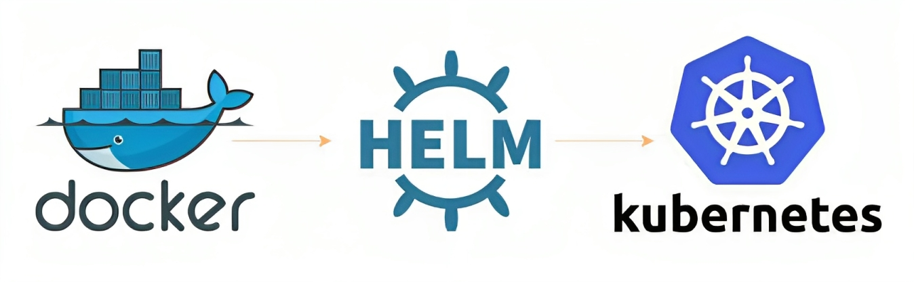

# hello-k8s
Simple Hello-World webpage, written in [Pyhton](https://www.python.org/), powered by [Flask](https://flask.palletsprojects.com/), Integrated with [GitHub Actions](https://github.com/features/actions), Chart by [Helm](https://helm.sh/) and Deployed with [Kubernetes](https://kubernetes.io/).

  

